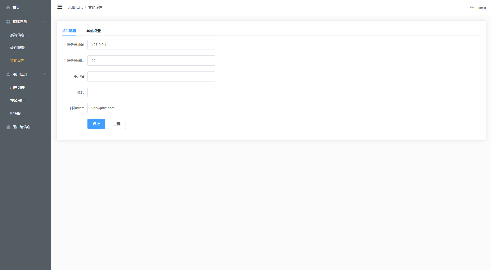
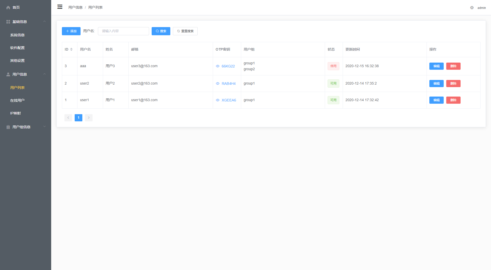

# AnyLink

[](https://github.com/bjdgyc/anylink/actions)
[](https://pkg.go.dev/github.com/bjdgyc/anylink)
[](https://goreportcard.com/report/github.com/bjdgyc/anylink)
[](https://codecov.io/gh/bjdgyc/anylink)


[](https://hub.docker.com/r/bjdgyc/anylink)


AnyLink 是一个企业级远程办公 sslvpn 的软件，可以支持多人同时在线使用。

## Repo

> github: https://github.com/bjdgyc/anylink

> gitee: https://gitee.com/bjdgyc/anylink

## Introduction

AnyLink 基于 [ietf-openconnect](https://tools.ietf.org/html/draft-mavrogiannopoulos-openconnect-02)
协议开发，并且借鉴了 [ocserv](http://ocserv.gitlab.io/www/index.html) 的开发思路，使其可以同时兼容 AnyConnect 客户端。

AnyLink 使用 TLS/DTLS 进行数据加密，因此需要 RSA 或 ECC 证书，可以使用私有自签证书，可以通过 Let's Encrypt 和 TrustAsia
申请免费的 SSL 证书。

AnyLink 服务端仅在 CentOS 7、CentOS 8、Ubuntu 18.04、Ubuntu 20.04 测试通过，如需要安装在其他系统，需要服务端支持 tun/tap
功能、ip 设置命令、iptables命令。

## Screenshot


## Donate

> 如果您觉得 anylink 对你有帮助，欢迎给我们打赏，也是帮助 anylink 更好的发展。
>
> [查看打赏列表](doc/README.md)

<p>
    
</p>

## Installation

> 没有编程基础的同学建议直接下载 release 包，从下面的地址下载 anylink-deploy.tar.gz
>
> https://github.com/bjdgyc/anylink/releases
>
> https://gitee.com/bjdgyc/anylink/releases
>
> 如果不会安装，可以提供有偿远程协助服务(200 CNY)。添加QQ(68492170)联系我
>
> 也可以添加QQ群 咨询群内大佬
>
> 添加QQ群①(已满): 567510628
>
> 添加QQ群②: 739072205

### 使用问题

> 对于测试环境，可以直接进行测试，需要客户端取消勾选【阻止不受信任的服务器(Block connections to untrusted servers)】
>
> 对于线上环境，尽量申请安全的https证书(跟nginx使用的pem证书类型一致)
>
> 群共享文件有相关客户端软件下载，其他版本没有测试过，不保证使用正常
>
> 其他问题 [前往查看](doc/question.md)
>
> 默认管理后台访问地址  https://host:8800 或 https://域名:8800 默认账号密码 admin 123456
>
> 首次使用，请在浏览器访问  https://域名:443   浏览器提示安全后，在客户端输入 【域名:443】 即可

### 自行编译安装

> 需要提前安装好 docker

```shell
git clone https://github.com/bjdgyc/anylink.git

# docker编译 参考软件版本(不需要安装)
# go 1.20.12
# node v16.20.2
# yarn 1.22.19


cd anylink

# 编译前端
bash build_web.sh
# 编译 anylink-deploy 发布文件
bash build.sh

# 注意使用root权限运行
cd anylink-deploy
sudo ./anylink

# 默认管理后台访问地址
# https://host:8800
# 默认账号 密码
# admin 123456


```

## Feature

- [x] IP 分配(实现 IP、MAC 映射信息的持久化)
- [x] TLS-TCP 通道
- [x] DTLS-UDP 通道
- [x] 兼容 AnyConnect
- [x] 兼容 OpenConnect
- [x] 基于 tun 设备的 nat 访问模式
- [x] 基于 tun 设备的桥接访问模式
- [x] 基于 macvtap 设备的桥接访问模式
- [x] 支持 [proxy protocol v1&v2](http://www.haproxy.org/download/2.2/doc/proxy-protocol.txt) 协议
- [x] 用户组支持
- [x] 用户组策略支持
- [x] 多用户支持
- [x] 用户策略支持
- [x] TOTP 令牌支持
- [x] TOTP 令牌开关
- [x] 流量速率限制
- [x] 后台管理界面
- [x] 访问权限管理
- [x] 用户活动审计功能
- [x] IP 访问审计功能(支持多端口、连续端口)
- [x] 域名动态拆分隧道（域名路由功能）
- [x] radius认证支持
- [x] LDAP认证支持
- [x] 空闲链接超时自动断开
- [x] 流量压缩功能
- [x] 出口 IP 自动放行
- [x] 支持多服务的配置区分
- [x] 支持私有自签证书
- [x] 支持内网域名解析(指定的域名走内网dns)
- [ ] 基于 ipvtap 设备的桥接访问模式

## Config

> 示例配置文件内有详细的注释，根据注释填写配置即可。

```shell
# 查看帮助信息
./anylink -h

# 生成后台密码
./anylink tool -p 123456

# 生成jwt密钥
./anylink tool -s

# 查看所有配置项
./anylink tool -d
```

> 数据库配置示例
>
> 数据库表结构自动生成，无需手动导入(请赋予 DDL 权限)

| db_type  | db_source                                              |
|----------|--------------------------------------------------------|
| sqlite3  | ./conf/anylink.db                                      |
| mysql    | user:password@tcp(127.0.0.1:3306)/anylink?charset=utf8 |
| postgres | user:password@localhost/anylink?sslmode=verify-full    |

> 示例配置文件
>
> [conf/server-sample.toml](server/conf/server-sample.toml)

## Upgrade

> 升级前请备份配置文件`conf`目录 和 数据库，并停止服务
>
> 使用新版的 `anylink` 二进制文件替换旧版
>
> 重启服务后，即可完成升级

## Setting

### 依赖设置

> 服务端依赖安装:
>
> centos: yum install iptables iproute
>
> ubuntu: apt-get install iptables iproute2

### link_mode 设置

> 以下参数必须设置其中之一

网络模式选择，需要配置 `link_mode` 参数，如 `link_mode="tun"`,`link_mode="macvtap"`,`link_mode="tap"(不推荐)` 等参数。
不同的参数需要对服务器做相应的设置。

建议优先选择 tun 模式，其次选择 macvtap 模式，因客户端传输的是 IP 层数据，无须进行数据转换。 tap 模式是在用户态做的链路层到
IP 层的数据互相转换，性能会有所下降。 如果需要在虚拟机内开启 tap
模式，请确认虚拟机的网卡开启混杂模式。

#### tun 设置

1. 开启服务器转发

```shell
# 新版本支持自动设置ip转发

# file: /etc/sysctl.conf
net.ipv4.ip_forward = 1

#执行如下命令
sysctl -w net.ipv4.ip_forward=1

# 查看设置是否生效
cat /proc/sys/net/ipv4/ip_forward
```

2.1 设置 nat 转发规则(二选一)

```shell
systemctl stop firewalld.service
systemctl disable firewalld.service

# 新版本支持自动设置nat转发，如有其他需求可以参考下面的命令配置

# 请根据服务器内网网卡替换 eth0
# iptables -t nat -A POSTROUTING -s 192.168.90.0/24 -o eth0 -j MASQUERADE
# 如果执行第一个命令不生效，可以继续执行下面的命令
# iptables -A FORWARD -i eth0 -s 192.168.90.0/24 -j ACCEPT
# 查看设置是否生效
# iptables -nL -t nat
```

2.2 使用全局路由转发(二选一)

```shell
# 假设anylink所在服务器的内网ip: 10.1.2.10

# 首先关闭nat转发功能
iptables_nat = false

# 传统网络架构，在华三交换机添加以下静态路由规则
ip route-static 192.168.90.0 255.255.255.0 10.1.2.10
# 其他品牌的交换机命令，请参考以下地址
https://cloud.tencent.com/document/product/216/62007

# 公有云环境下，需设置vpc下的路由表，添加以下路由策略
目的端: 192.168.90.0/24
下一跳类型: 云服务器
下一跳: 10.1.2.10

```

3. 使用 AnyConnect 客户端连接即可

#### 桥接设置

1. 设置配置文件

> macvtap 设置相对比较简单，只需要配置相应的参数即可。
>
> 网络要求：需要网络支持 ARP 传输，可通过 ARP 宣告普通内网 IP。
>
> 网络限制：云环境下不能使用，网卡mac加白环境不能使用，802.1x认证网络不能使用
>
> 以下参数可以通过执行 `ip a` 查看


1.1 arp_proxy

```

# file: /etc/sysctl.conf
net.ipv4.conf.all.proxy_arp = 1

#执行如下命令
sysctl -w net.ipv4.conf.all.proxy_arp=1


配置文件修改:

# 首先关闭nat转发功能
iptables_nat = false


link_mode = "tun"
#内网主网卡名称
ipv4_master = "eth0"
#以下网段需要跟ipv4_master网卡设置成一样
ipv4_cidr = "10.1.2.0/24"
ipv4_gateway = "10.1.2.99"
ipv4_start = "10.1.2.100"
ipv4_end = "10.1.2.200"

```

1.2 macvtap

```

# 命令行执行 master网卡需要打开混杂模式
ip link set dev eth0 promisc on

#=====================#

# 配置文件修改
# 首先关闭nat转发功能
iptables_nat = false

link_mode = "macvtap"
#内网主网卡名称
ipv4_master = "eth0"
#以下网段需要跟ipv4_master网卡设置成一样
ipv4_cidr = "10.1.2.0/24"
ipv4_gateway = "10.1.2.1"
ipv4_start = "10.1.2.100"
ipv4_end = "10.1.2.200"
```

## Deploy

> 部署配置文件放在 `deploy` 目录下，请根据实际情况修改配置文件

### Systemd

1. 添加 anylink 程序
    - 首先把 `anylink-deploy` 文件夹放入 `/usr/local/anylink-deploy`
    - 添加执行权限 `chmod +x /usr/local/anylink-deploy/anylink`
2. 把 `anylink.service` 脚本放入：
    - centos: `/usr/lib/systemd/system/`
    - ubuntu: `/lib/systemd/system/`
3. 操作命令:
    - 加载配置: `systemctl daemon-reload`
    - 启动: `systemctl start anylink`
    - 停止: `systemctl stop anylink`
    - 开机自启: `systemctl enable anylink`

### Docker Compose

1. 进入 `deploy` 目录
2. 执行脚本 `docker-compose up`

### k8s

1. 进入 `deploy` 目录
2. 执行脚本 `kubectl apply -f deployment.yaml`

## Docker

### anylink 镜像地址

对于国内用户，为提高镜像拉取体验，可以考虑拉取存放于阿里云镜像仓库的镜像，镜像名称及标签如下表所示(
具体版本号可以查看 `version` 文件):

|    支持设备/平台    |       DockerHub       |                             阿里云镜像仓库                             |
|:-------------:|:---------------------:|:---------------------------------------------------------------:|
| x86_64/amd64  | bjdgyc/anylink:latest |     registry.cn-hangzhou.aliyuncs.com/bjdgyc/anylink:latest     |
| x86_64/amd64  | bjdgyc/anylink:0.12.1 |     registry.cn-hangzhou.aliyuncs.com/bjdgyc/anylink:0.12.1     |
| armv8/aarch64 | bjdgyc/anylink:latest | registry.cn-hangzhou.aliyuncs.com/bjdgyc/anylink:arm64v8-latest |
| armv8/aarch64 | bjdgyc/anylink:0.12.1 | registry.cn-hangzhou.aliyuncs.com/bjdgyc/anylink:arm64v8-0.12.1 |

1. 获取镜像
   ```bash
   # 具体tag可以从docker hub获取
   # https://hub.docker.com/r/bjdgyc/anylink/tags
   docker pull bjdgyc/anylink:latest
   docker pull registry.cn-hangzhou.aliyuncs.com/bjdgyc/anylink:latest
   ```

2. 查看命令信息
   ```bash
   docker run -it --rm bjdgyc/anylink -h
   ```

3. 生成密码
   ```bash
   docker run -it --rm bjdgyc/anylink tool -p 123456
   #Passwd:$2a$10$lCWTCcGmQdE/4Kb1wabbLelu4vY/cUwBwN64xIzvXcihFgRzUvH2a
   ```

4. 生成 jwt secret
   ```bash
   docker run -it --rm bjdgyc/anylink tool -s
   #Secret:9qXoIhY01jqhWIeIluGliOS4O_rhcXGGGu422uRZ1JjZxIZmh17WwzW36woEbA
   ```

5. 查看所有配置项
   ```bash
   docker run -it --rm bjdgyc/anylink tool -d
   ```

6. 启动容器
   ```bash
   # 默认启动
   docker run -itd --name anylink --privileged \
       -p 443:443 -p 8800:8800 -p 443:443/udp \
       --restart=always \
       bjdgyc/anylink
   
   # 自定义配置目录
   # 首次启动会自动创建配置文件
   # 配置文件初始化完成后，容器会强制退出，请重新启动容器
   docker run -itd --name anylink --privileged \
       -p 443:443 -p 8800:8800 -p 443:443/udp \
       -v /home/myconf:/app/conf \
       --restart=always \
       bjdgyc/anylink
   
   docker restart anylink
   ```

6. 使用自定义参数启动容器
   ```bash
   # 参数可以参考 ./anylink tool -d
   # 可以使用命令行参数 或者 环境变量 配置
   docker run -itd --name anylink --privileged \
       -e LINK_LOG_LEVEL=info \
       -p 443:443 -p 8800:8800 -p 443:443/udp \
       -v /home/myconf:/app/conf \
       --restart=always \
       bjdgyc/anylink \
       --ip_lease=1209600 # IP地址租约时长
   ```

7. 构建镜像 (非必需)
   ```bash
   #获取仓库源码
   git clone https://github.com/bjdgyc/anylink.git
   # 构建镜像
   sh build_docker.sh
   或
   docker build -t anylink -f docker/Dockerfile .
   ```

## 常见问题

请前往 [问题地址](doc/question.md) 查看具体信息

<!--
## Discussion

群共享文件有相关软件下载

添加微信群: 群共享文件有相关软件下载


-->

## Support Document

- [三方文档-男孩的天职](https://note.youdao.com/s/X4AxyWfL)
- [三方文档-issues](https://github.com/bjdgyc/anylink/issues)
- [三方文档-思有云](https://www.ioiox.com/archives/128.html)
- [三方文档-杨杨得亿](https://yangpin.link/archives/1633.html)  [Windows电脑连接步骤-杨杨得亿](https://yangpin.link/archives/1697.html)

## Support Client

- [AnyConnect Secure Client](https://www.cisco.com/) (可通过群文件下载: Windows/macOS/Linux/Android/iOS)
- [OpenConnect](https://gitlab.com/openconnect/openconnect) (Windows/macOS/Linux)
- [三方 AnyLink Secure Client](https://github.com/tlslink/anylink-client) (Windows/macOS/Linux)
- [三方客户端下载地址](https://cisco.yangpin.link) (Windows/macOS/Linux/Android/iOS)

## Contribution

欢迎提交 PR、Issues，感谢为 AnyLink 做出贡献。

注意新建 PR，需要提交到 dev 分支，其他分支暂不会合并。

## Other Screenshot

<details>
<summary>展开查看</summary>






</details>

## License

本项目采用 AGPL-3.0 开源授权许可证，完整的授权说明已放置在 LICENSE 文件中。

## Thank

<a href="https://www.jetbrains.com">
    
</a>
